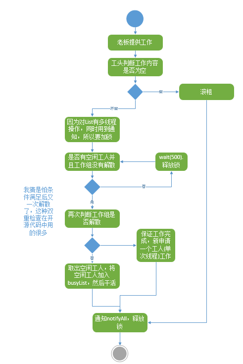
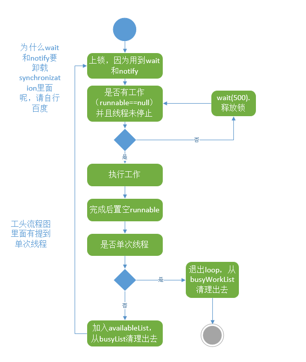

[quartz源码分析——执行引擎和线程模型](https://www.cnblogs.com/liuroy/p/7517777.html)

- SimpleThreadPool——quartz里的工头儿
- WorkerThread——quartz里的工人
- QuartzSchedulerThread——Quartz里面的老板

| 类名 | 名词解释 |
| --- | --- |
| SimpleThreadPool| 工头儿 |
| WorkThread| 工人 |
| QuartzScheduleThread| 老板 |
| JobRunShell | 工作，实现了Runnable |

**runInThread 就是工头对老板提供的对外接口，Runnable就是老板安排的工作，流程是这样的:**



**工头把任务交给工人，工人线程此时阻塞，当runnable被赋值时，工作线程被唤醒**



**QuartzSchedulerThread是quartz里真正负责时间调度的类，这个线程的run方法也是最外层的loop。主要负责任务触发，工作包装，任务批处理的控制，这个方法是本章最难的一个方法了**


**线程模型图**


### 1.配置Scheduler的主要属性

这些属性配置Scheduler的标识以及其它顶级的设置。

| 属性名 | 必须 | 类型 | 默认值 |
| --- | --- | --- | --- |
| org.quartz.scheduler.instanceName | no | string | 'QuartzScheduler' |
| org.quartz.scheduler.instanceId | no | string | 'NON_CLUSTERED' |
| org.quartz.scheduler.instanceIdGenerator.class | no | string (class name) | org.quartz.simpl.SimpleInstanceIdGenerator |
| org.quartz.scheduler.threadName | no | string | instanceName + '_QuartzSchedulerThread' |
| org.quartz.scheduler.makeSchedulerThreadDaemon | no | boolean | false |
| org.quartz.scheduler.threadsInheritContextClassLoaderOfInitializer | no | boolean false |
| org.quartz.scheduler.idleWaitTime | no | long | 30000 |
| org.quartz.scheduler.dbFailureRetryInterval | no | long | 15000 |
| org.quartz.scheduler.classLoadHelper.class | no | string (class name) | org.quartz.simpl.CascadingClassLoadHelper |
| org.quartz.scheduler.jobFactory.class | no | string (class name) | org.quartz.simpl.PropertySettingJobFactory |
| org.quartz.context.key.SOME_KEY | no | string | none |
| org.quartz.scheduler.userTransactionURL | no | string (url) | 'java:comp/UserTransaction' |
| org.quartz.scheduler.wrapJobExecutionInUserTransaction | no | boolean | false |
| org.quartz.scheduler.skipUpdateCheck | no | boolean | false |
| org.quartz.scheduler.batchTriggerAcquisitionMaxCount | no | int | 1 |
| org.quartz.scheduler.batchTriggerAcquisitionFireAheadTimeWindow | no | long | 0 |

**org.quartz.scheduler.instanceName**

可以是任意字符串，这个值对于scheduler自己来说没有任何意义，但是当多个实例存在同一个程序中时，它可以用于区分不同的scheduler。如果你使用集群特性，那么在集群中逻辑术语同一个scheduler的实例必须使用相同的名字。

**org.quartz.scheduler.instanceId** 

可以是任意字符串，但是如果在集群中多个scheduler在逻辑上是同一个Scheduler，那么就必须是唯一的。如果将它的值设置为“AUTO”，它会自动为你生成Id。如果将它的值可以为“SYS_PROP”，它的值来自系统属性“org.quartz.scheduler.instanceId”。

**org.quartz.scheduler.instanceIdGenerator.class** 

只有org.quartz.scheduler.instanceId设置为“AUTO”才使用。默认为“org.quartz.simpl.SimpleInstanceIdGenerator”，它是主机名和时间戳生成实例Id的。其它的IntanceIdGenerator实现包括SystemPropertyInstanceIdGenerator（它从系统属性“org.quartz.scheduler.instanceId”获取实例Id），和HostnameInstanceIdGenerator（它使用本地主机名InetAddress.getLocalHost().getHostName()生成实例Id）。你也实现你自己的InstanceIdGenerator。

**org.quartz.scheduler.threadName** 

可以任意合法的线程名。如果这个属性没有设置，那么线程就会用Scheduler的名字（“org.quartz.scheduler.instanceName”）加上字符串“_QuartzSchedulerThread”。

**org.quartz.scheduler.makeSchedulerThreadDaemon** 

布尔值（true或者false），表明scheduler的主线程是否为守护线程。如果你使用的是SimpleThreadPool（大部分情况都是用的这个），请参见它的org.quartz.scheduler.makeSchedulerThreadDaemon属性。

**org.quartz.scheduler.threadsInheritContextClassLoaderOfInitializer** 

A布尔值（true或者false），表明Quartz产生的线程是否继承初始化Quartz实例的线程的上下文类加载器。这会影响Quartz主调度线程，JDBCJobStore的失败处理线程（使用JDBCJobStore的话），还有SimpleThreadPool中的线程（如果使用SimpleThreadPool的话）。将这个值设置为true，对于类加载、JNDI查找以及其它在应用服务器内使用Quartz的问题有所帮助。

**org.quartz.scheduler.idleWaitTime** 

当scheduler空闲时，scheduler重新查询可用的trigger等待的时间（单位毫秒）。通常你不需要调整这个参数，除非你使用XA事务，并且不应该延迟触发trigger会而应该立即触发。不推荐小于5000ms，因为它会造成大量的数据库查询。小于1000是不合法的。

**org.quartz.scheduler.dbFailureRetryInterval** 

当检测到失去与JobStore（或数据库）的连接时，scheduler重连的等待时间（单位毫秒）。当使用RamJobStore时，该参数没有意义。

**org.quartz.scheduler.classLoadHelper.class**

默认为最稳定的方法，就是使用“org.quartz.simpl.CascadingClassLoadHelper”类，它会使用其它的ClassLoadHelper类，直到有一个工作。你可能会发现不需要设置这个属性，尽管在应用服务器内会有奇怪的事情发生。所有当前实现的ClassLoadHelper都位于org.quartz.simpl包下。

**org.quartz.scheduler.jobFactory.class**

使用的JobFactory的类名。JobFatcory负责生成Job实例。默认值为“org.quartz.simpl.PropertySettingJobFactory”，它简单的调用Job类的newInstance()方法来生成实例。PropertySettingJobFactory也分别用SchedulerContext、Job还有Trigger的JobDataMap设置Job的属性。

**org.quartz.context.key.SOME_KEY**

表示名字-值对，它会作为字符串放入SchedulerContext中（参见Scheduler.getContext()）。例如，“org.quartz.context.key.MyKey = MyValue”会等价于执行scheduler.getContext().put(“MyKey”, “MyValue”)。

注意：与事务有关的属性可以不用设置，除非你使用JTA事务。

**org.quartz.scheduler.userTransactionURL**

设置为JNDI的URL，Quartz基于此定位应用服务器的UserTransaction管理者。默认值为“java:comp/UserTransaction”，这适用于大多数应用服务器。Websphere用户需要将它设置为“jta/usertransaction”。只有使用JobStoreCMT且org.quartz.scheduler.wrapJobExecutionInUserTransaction为true时，才需要配置这个属性。

**org.quartz.scheduler.wrapJobExecutionInUserTransaction** 

如果你想要在执行Job之前启动一个UserTransaction，那么这个值就需要设置true。在Job执行完成且JobDataMap更新完成（有状态Job）之后，事务就会条提交。默认值为false。你也可能对在Job类上使用@ExecuteInJTATransaction 注解感兴趣，对于单个Job来说，它能让你控制Quartz是否应该启动一个JTA事务，这个属性对所有Job都有效。

**org.quartz.scheduler.skipUpdateCheck**

是否跳过快速访问web请求，以确定是否需要下载Quartz的更新版本。如果执行检查，且找到了更新，它会在Quartz日志中报告更新可用。你可以禁止更新检查，只需设置系统属性“org.terracotta.quartz.skipUpdateCheck=true”，在命名行用-D参数指定。在生产环境部署时，建议禁止更新检查。

**org.quartz.scheduler.batchTriggerAcquisitionMaxCount**

Scheduler一次获取trigger的最大数量。默认值为1。这个数字越大，触发效率越高（在有许多trigger需要同时触发的场景下），但是在集群节点之间可能会有负载均衡的代价。如果这个属性的值大于1，且使用JDBCJobStore，那么属性“org.quartz.jobStore.acquireTriggersWithinLock”必须设置true，以避免数据损坏。

**org.quartz.scheduler.batchTriggerAcquisitionFireAheadTimeWindow** 

允许triger在调度时间之前获取和触发的时间（单位毫秒）。默认0。这个数字越大，批量获取要触发的trigger且在同一时刻触发一个以上的trigger的可能性越大，但是以不精确调度为代价的(triggers可能提前触发)。这对于那些Scheduler有大量的trigger需要几乎同时触发的场景是很有用的（一般是性能测试）。

### 2.配置线程池

| 属性名 | 必须 | 类型 | 默认值 |
| --- | --- | --- | --- |
| org.quartz.threadPool.class | yes | string (类名) | null |
| org.quartz.threadPool.threadCount | yes | int | -1 |
| org.quartz.threadPool.threadPriority | no | int | Thread.NORM_PRIORITY (5) |

**org.quartz.threadPool.class**

使用ThreadPool的实现的名字。Quartz自带的线程池是“org.quartz.simpl.SimpleThreadPool”，几乎满足所有用户的需求。它的行为很简单，测试的也很好。它提供了固定大小的线程池，生命周期与Scheduler相同。

**org.quartz.threadPool.threadCount**

可以是任意的正整数。实际上只有1到100会用到。这是并行执行job可用的线程数。如果只有几个job，一天也只有几次触发，那么一个线程就足够了！如果你有成百上千的job，且每一个每一分钟都会触发。那么你可能想要让线程的数量达到50或者100了（这取决于你的job执行的工作以及系统资源了）。

**org.quartz.threadPool.threadPriority**

可以是Thread.MIN_PRIORITY (1)和Thread.MAX_PRIORITY (10)之间的任意整数。默认为Thread.NORM_PRIORITY (5).

#### 2.1 配置线程池

| 属性名 | 必须 | 类型 | 默认值 |
| --- | --- | --- | --- |
| org.quartz.threadPool.makeThreadsDaemons | no | boolean | false |
| org.quartz.threadPool.threadsInheritGroupOfInitializingThread | no | boolean | true |
| org.quartz.threadPool.threadsInheritContextClassLoaderOfInitializingThread | no | boolean | false |
| org.quartz.threadPool.threadNamePrefix | no | string | [Scheduler Name]_Worker |

**org.quartz.threadPool.makeThreadsDaemons** 

可以设为true，那么线程池中创建的线程都是守护线程。默认为false。也可参见org.quartz.scheduler.makeSchedulerThreadDaemon属性。

**org.quartz.threadPool.threadsInheritGroupOfInitializingThread**

可以为true或者false，默认为false。

**org.quartz.threadPool.threadsInheritContextClassLoaderOfInitializingThread**

可以为true或者false，默认为false。

**org.quartz.threadPool.threadNamePrefix**

线程池中线程名字的前缀，最后附加一个数字。

#### 2.2 自定义的ThreadPool

如果你使用的自己实现的线程池，你可以将属性名按下面这样命名：

**设置自定义ThreadPool的属性**
**org.quartz.threadPool.class = com.mycompany.goo.FooThreadPool**
**org.quartz.threadPool.somePropOfFooThreadPool = someValue**

### 3.配置全局的监听器

全局的监听器可以由StdSchedulerFactory实例化和配置，或者由你的应用自己在运行时配置，然后将监听器注册到scheduler中。全局的监听器监听每一个job或trigger的事件，而不只是直接引用它的job和trigger。

通过配置文件配置监听器主要包括指定一个名字，然后指定类名，以及其它需要设置的属性。这个类必须有一个无参数构造器，且属性时分别设置的。只支持基本数据类型(包括String)。

全局TriggerListener的通用模式定义：

**配置全局的TriggerListener** 
**org.quartz.triggerListener.NAME.class = com.foo.MyListenerClass**
**org.quartz.triggerListener.NAME.propName = propValue**
**org.quartz.triggerListener.NAME.prop2Name = prop2Value**

全局JobListener的通用模式定义：

**配置全局的JobListener** 
**org.quartz.jobListener.NAME.class = com.foo.MyListenerClass**
**org.quartz.jobListener.NAME.propName = propValue**
**org.quartz.jobListener.NAME.prop2Name = prop2Value**

### 4.配置Scheduler插件

类似于监听器，配置插件也是通过配置文件，主要包括指定一个名字，然后指定类名，以及其它需要设置的属性。这个类必须有一个无参数构造器，且属性时分别设置的。只支持基本数据类型(包括String)。

这样，配置插件的通用模式如下：

配置一个插件
**org.quartz.plugin.NAME.class = com.foo.MyPluginClass**
**org.quartz.plugin.NAME.propName = propValue**
**org.quartz.plugin.NAME.prop2Name = prop2Value**

Quartz自带了几个插件，可以在org.quartz.plugins包（或子包）下找到。

#### 4.1 LoggingTriggerHistoryPlugin配置示例

LoggingTriggerHistoryPlugin会捕获triger事件（因为它也是一个TriggerListener），然后用Jakarta Commons-Logging记录到日志中。可以参见JavaDoc了解它的参数。

**LoggingTriggerHistoryPlugin配置示例**

**org.quartz.plugin.triggHistory.class = org.quartz.plugins.history.LoggingTriggerHistoryPlugin**
**org.quartz.plugin.triggHistory.triggerFiredMessage = Trigger \{1\}.\{0\} fired job \{6\}.\{5\} at: \{4, date, HH:mm:ss MM/dd/yyyy}**
**org.quartz.plugin.triggHistory.triggerCompleteMessage = Trigger \{1\}.\{0\} completed firing job \{6\}.\{5\} at \{4, date, HH:mm:ss MM/dd/yyyy\}.**

#### 4.2 XMLSchedulingDataProcessorPlugin配置示例

这是一个Job初始化插件，它从XML文件中读取job和trigger，并将它们添加到scheduler中。它也可以删除已有的数据。参见这个类的JavaDoc了解更多信细节。

**Job初始化插件配置示例**

**org.quartz.plugin.jobInitializer.class = org.quartz.plugins.xml.XMLSchedulingDataProcessorPlugin**
**org.quartz.plugin.jobInitializer.fileNames = data/my_job_data.xml**
**org.quartz.plugin.jobInitializer.failOnFileNotFound = true**

XML schema定义是http://www.quartz-scheduler.org/xml/job_scheduling_data_1_8.xsd

#### 4.3 ShutdownHookPlugin配置示例

ShutdownHookPlugin捕获JVN终止的事件，并调用scheduler的shutdown方法。
 
**ShutdownHookPlugin配置示例**
 
**org.quartz.plugin.shutdownhook.class = org.quartz.plugins.management.ShutdownHookPlugin**
**org.quartz.plugin.shutdownhook.cleanShutdown = true**

### 5.配置RMI

没有基本属性是必需的，都有默认值。当通过RMI访问Quartz时，你需要启动一个Quartz实例，它通过RMI导出了服务。然后你创建一个客户端，配置Quartz scheduler来代理服务器上的工作。

一些用户可能会在客户端和服务端遇到类可用性问题（即Job类）。要解决这些问题，你需要理解RMI的基础代码和安全管理。你会发现下面这些资源是有用的：

RMI和基础代码介绍：http://www.kedwards.com/jini/codebase.html。重点之一就是要由客户端实现基础代码。

安全管理快速入门：http://gethelp.devx.com/techtips/java_pro/10MinuteSolutions/10min0500.asp

最后，从Java API文档，阅读RMISecurityManager稳定。

| 属性名 | 必需 | 默认值 |
| --- | --- | --- |
| org.quartz.scheduler.rmi.export | no | false |
| org.quartz.scheduler.rmi.registryHost | no | 'localhost' |
| org.quartz.scheduler.rmi.registryPort | no | 1099 |
| org.quartz.scheduler.rmi.createRegistry | no | 'never' |
| org.quartz.scheduler.rmi.serverPort | no | random |
| org.quartz.scheduler.rmi.proxy | no | false |

**org.quartz.scheduler.rmi.export** 

如果你想要让Quartz Scheduler通过RMI导出，那么需要将rmi.export标志为true。

**org.quartz.scheduler.rmi.registryHost** 

可以找到RMI注册表的主机(通常为localhost)。

**org.quartz.scheduler.rmi.registryPort**

RMI注册表监听的端口(通常为1099)。

**org.quartz.scheduler.rmi.createRegistry**

根据你想要Quartz如何创建RMI注册表，来设置rmi.createRegistry标志。如果你不想让Quartz创建注册表（已经有一个外部的注册表在运行），那么就用false或never。如果你想要让Quartz第一次尝试使用已有的注册表，然后创建一个，就设置为true或则as_needed。如果你想要Quartz尝试创建一个注册表，然后使用它，那么就设置为always。如果已经创建了，它会绑定到org.quartz.scheduler.rmi.registryPort指定的端口上，org.quartz.rmi.registryHost应该为localhost。

**org.quartz.scheduler.rmi.serverPort**

Quartz Scheduler服务绑定和监听连接的端口。默认情况下，RMI服务会随机选择一个端口将scheduler绑定到RMI注册表。

**org.quartz.scheduler.rmi.proxy**

如果你想要连接到远端提供服务的scheduler，那么将org.quartz.scheduler.rmi.proxy标志设置为true。你也必须为RMI注册表指定一个主机和端口，通常为localhost和1099。

注意，在同一个配置文件中，将org.quartz.scheduler.rmi.export和org.quartz.scheduler.rmi.proxy都设置为true是没有意义的。如果你这样做了，那么export选项就会被忽略。如果export和proxy属性都是false当然是合法的，如果你不使用RMI的话。

### 6.配置RAMJobStore

RAMJobStore用于在内存里存储调度信息(job、triggers和calendar)。RAMJobStore 快速且轻量，但是当进程终止时所有调度信息会丢失。

**选择RAMJobStore的话，需要这样设置org.quartz.jobStore.class属性：**
**设置Scheduler的JobStore为RAMJobStore** 
**org.quartz.jobStore.class = org.quartz.simpl.RAMJobStore**

RAMJobStore可以调整以下参数：

| 属性名 | 必须 | 类型 | 默认值 |
| --- | --- | --- | --- |
| org.quartz.jobStore.misfireThreshold | no | int | 60000 |

**org.quartz.jobStore.misfireThreshold** 

trigger被认为失败之前，scheduler能够承受的下一次触发时间（单位毫秒）。默认值为60秒。

### 7.配置JDBC-JobStoreTX

JDBCJobStore用于将调度信息（job、trigger和calendar）存储到关系数据库中。实际上有两种JDBCJobStore类供选择，依赖于你需要的事务行为。

在每一个动作之后（例如添加一个job），JobStoreTX通过调用commit()方法或者rollback()方法管理所有数据库连接的事务。如果你是在独立的应用中使用或者在Servlet容器里没有使用JTA事务，那么JDBCJobStore是合适的。

选择JobStoreTX的话，需要这样设置org.quartz.jobStore.class属性：

**设置Scheduler的JobStore为JobStoreTX**
**org.quartz.jobStore.class = org.quartz.impl.jdbcjobstore.JobStoreTX**

JobStoreTX可以调整以下参数：

| 属性名 | 必须 | 类型 | 默认值 |
| --- | --- | --- | --- |
| org.quartz.jobStore.driverDelegateClass | yes | string | null |
| org.quartz.jobStore.dataSource | yes | string | null |
| org.quartz.jobStore.tablePrefix | no | string | “QRTZ_” |
| org.quartz.jobStore.useProperties | no | boolean | false |
| org.quartz.jobStore.misfireThreshold | no | int | 60000 |
| org.quartz.jobStore.isClustered | no | boolean | false |
| org.quartz.jobStore.clusterCheckinInterval | no | long | 15000 |
| org.quartz.jobStore.maxMisfiresToHandleAtATime | no | int | 20 |
| org.quartz.jobStore.dontSetAutoCommitFalse | no | boolean | false |
| org.quartz.jobStore.selectWithLockSQL | no | string | “SELECT * FROM {0}LOCKS WHERE SCHED_NAME = {1} AND LOCK_NAME = ? FOR UPDATE“ |
| org.quartz.jobStore.txIsolationLevelSerializable | no | boolean | false |
| org.quartz.jobStore.acquireTriggersWithinLock | no | boolean | false (or true - see doc below) |
| org.quartz.jobStore.lockHandler.class | no | string | null |
| org.quartz.jobStore.driverDelegateInitString | no | string | null |

**org.quartz.jobStore.driverDelegateClass**

Driver代理直到各种数据库系统的方言。可能的选择包括：

- org.quartz.impl.jdbcjobstore.StdJDBCDelegate(完全兼容JDBC的驱动)
- org.quartz.impl.jdbcjobstore.MSSQLDelegate(Microsoft SQL Server和Sybase)
- org.quartz.impl.jdbcjobstore.PostgreSQLDelegate
- org.quartz.impl.jdbcjobstore.WebLogicDelegate(WebLogic驱动)
- org.quartz.impl.jdbcjobstore.oracle.OracleDelegate
- org.quartz.impl.jdbcjobstore.oracle.WebLogicOracleDelegate(Weblogic使用的Oracle驱动)
- org.quartz.impl.jdbcjobstore.oracle.weblogic.WebLogicOracleDelegate(Weblogic使用的Oracle)
- org.quartz.impl.jdbcjobstore.CloudscapeDelegate
- org.quartz.impl.jdbcjobstore.DB2v6Delegate
- org.quartz.impl.jdbcjobstore.DB2v7Delegate
- org.quartz.impl.jdbcjobstore.DB2v8Delegate
- org.quartz.impl.jdbcjobstore.HSQLDBDelegate
- org.quartz.impl.jdbcjobstore.PointbaseDelegate
- org.quartz.impl.jdbcjobstore.SybaseDelegate

注意许多数据库都能与StdJDBCDelegate一起工作，而其它的数据库也能与其它的数据库代理一起动作。例如,Derby就可以使用Cloudscape代理（不惊讶）。

**org.quartz.jobStore.dataSource** 

这个属性的值必须是配置属性文件中定义的DataSource的名字。参见配置DataSource了解更多信息。

**org.quartz.jobStore.tablePrefix** 

JDBCJobStore的表前缀属性是一个字符串，等于数据库中数据表的前缀。如果表前缀不同，那么在同一个数据库中可以创建多个数据表。

**org.quartz.jobStore.useProperties** 

“org.quartz.jobStore.useProperties”配置参数可以被设置为true（默认为false），这样可以指导JDBCJobStore，JobDataMaps中的值都是字符串，因此这样可以以名字-值对存储，而不是存储更加复杂的对象（序列化形式BLOB）。从长远来看，这是很安全的，因为避免了将非字符串类序列化为BLOB的类版本问题。

**org.quartz.jobStore.misfireThreshold** 

Scheduler认为trigger能够承受的下一次触发失败时间（单位毫秒）。默认值为60秒。

**org.quartz.jobStore.isClustered** 

使用集群特性，这个属性必须为true。如果你有多个Quartz实例使用相同的数据库表，这个属性必须为true，否则你会体验一把大破坏。参见集群配置。

**org.quartz.jobStore.clusterCheckinInterval** 

设置当前实例check in集群中其它实例的频率。影响检测到故障实例的速度。

**org.quartz.jobStore.maxMisfiresToHandleAtATime** 

JobStore处理失败trigger的最大等待时间。同时处理多个trigger（多于几个）回引发数据表长时间锁定，触发其它的trigger（还没有失败）的性能就会受到限制。

**org.quartz.jobStore.dontSetAutoCommitFalse** 

将这个参数设置为true，就是告诉Quartz不要调用DataSource获取的连接的setAutoCommit(false)方法。这对某些场景是有帮助的，例如如果一个驱动已经关闭了，你调用它，它就会抱怨。这个属性默认为false，因为大多数驱动都会调用setAutoCommit(false)方法。

**org.quartz.jobStore.selectWithLockSQL** 

必须是一个字符串，在LOCKS表中选择一行，然后再这一行放一把锁。默认为“SELECT * FROM {0}LOCKS WHERE SCHED_NAME = {1} AND LOCK_NAME = ? FOR UPDATE”，这对于大多数数据库都适用。“{0}”由上面的配置的TABLE_PREFIX在运行时替换，而“{1}”由scheduler的名字替换。

**org.quartz.jobStore.txIsolationLevelSerializable** 

如果值为true，就是告诉Quartz（当使用JobStoreTX或CMT)调用JDBC连接的setTransactionIsolation(Connection.TRANSACTION_SERIALIZABLE)方法。这可以防止在高负载、持久事务时锁定超时。

**org.quartz.jobStore.acquireTriggersWithinLock** 

是否在数据库锁内获取下一个要触发的trigger。在之前的Quartz版本中，为避免死锁必须用它，但是现在不再是必要了，一次默认值为false。

如果“org.quartz.scheduler.batchTriggerAcquisitionMaxCount”的值大于1，且使用了JDBC JobStore，那么这个属性必须设置true，以避免数据损坏。在Quartz 2.1.1中，如果batchTriggerAcquisitionMaxCount大于1，那么默认值就是true。

**org.quartz.jobStore.lockHandler.class** 

用这个类名生成一个org.quartz.impl.jdbcjobstore.Semaphore实例，用于锁定控制JobStore的数据。这是一个高级配置特性，大多数用户不应该使用它。默认情况下，Quartz会选择最合适的Semaphore实现。MS SQL Server用户可能会对“org.quartz.impl.jdbcjobstore.UpdateLockRowSemaphore”感兴趣。

**org.quartz.jobStore.driverDelegateInitString** 

由“|”分割的属性（和它们的值），在初始化时，传递给DriverDelegate。

字符串的格式类似于：

“settingName=settingValue|otherSettingName=otherSettingValue|...“

StdJDBCDelegate和它所有的子类(Quartz自带的所有代理类)支持一个属性叫“triggerPersistenceDelegateClasses”，可以被设置为逗号（,）分割的类，它们实现了TriggerPersistenceDelegate 接口，用于存储自定义的trigger类型。参见SimplePropertiesTriggerPersistenceDelegateSupport类以及编写定义trigger的持久化代理示例。

### 8.配置JDBC-JobStoreCMT

JobStoreCMT依赖于使用Quartz的应用管理的事务。JTA事务必须在尝试调度（取消调度）job和trigger之前处于运行中。这允许调度工作作为更大事务的一部分。JobStoreCMT实际上需要两种数据源，一种是应用服务器管理它的连接事务（通过JTA），另一种是它有连接埠参与全局事务。当应用使用JTA事务（例如通过EJB回话Bean）执行工作时，JobStoreCMT是合适的。

选择RAMJobStore的话，需要这样设置org.quartz.jobStore.class属性：

**设置Scheduler的JobStore为JobStoreCMT** 
**org.quartz.jobStore.class = org.quartz.impl.jdbcjobstore.JobStoreCMT**

JobStoreCMT可以调整的参数如下：

| 属性名 | 必须 | 类型 | 默认值 |
| --- | --- | --- | --- |
| org.quartz.jobStore.driverDelegateClass | yes | string | null |
| org.quartz.jobStore.dataSource | yes | string | null |
| org.quartz.jobStore.nonManagedTXDataSource | yes | string | null |
| org.quartz.jobStore.tablePrefix | no | string | “QRTZ_“ |
| org.quartz.jobStore.useProperties | no | boolean | false |
| org.quartz.jobStore.misfireThreshold | no | int | 60000 |
| org.quartz.jobStore.isClustered | no | boolean | false |
| org.quartz.jobStore.clusterCheckinInterval | no | long | 15000 |
| org.quartz.jobStore.maxMisfiresToHandleAtATime | no | int | 20 |
| org.quartz.jobStore.dontSetAutoCommitFalse | no | boolean | false |
| org.quartz.jobStore.dontSetNonManagedTXConnectionAutoCommitFalse | no | boolean | false |
| org.quartz.jobStore.selectWithLockSQL | no | string | “SELECT * FROM {0}LOCKS WHERE SCHED_NAME = {1} AND LOCK_NAME = ? FOR UPDATE“ |
| org.quartz.jobStore.txIsolationLevelSerializable | no | boolean | false |
| org.quartz.jobStore.txIsolationLevelReadCommitted | no | boolean | false |
| org.quartz.jobStore.acquireTriggersWithinLock | no | boolean | false (or true - see doc below) |
| org.quartz.jobStore.lockHandler.class | no | string | null |
| org.quartz.jobStore.driverDelegateInitString | no | string | null |

**org.quartz.jobStore.dataSource** 

这个属性的值必须是配置文件中DataSource的名字。对于JobStoreCMT，要求这个数据源包含的连接要能参与JTA事务。这意味着DataSource是由应用服务器配置和维护的，Quartz只是通过JNDI引用它。

**org.quartz.jobStore.nonManagedTXDataSource** 

JobStoreCMT需要第二个数据源，它包含一些不受容器管理的事务。这个属性的值必须是配置文件中DataSource的名字。这个数据源必须包含非CMT连接。换句话说，它的连接杜宇Quartz来说调用commit和rollback方法是合法的。

**org.quartz.jobStore.dontSetNonManagedTXConnectionAutoCommitFalse** 

与org.quartz.jobStore.dontSetAutoCommitFalse属性一样，只是它适用于nonManagedTXDataSource。

**org.quartz.jobStore.lockHandler.class** 

Quartz自带的“JTANonClusteredSemaphore”提高了不少性能，虽然它是一个实验实训。

其它配置同JobStoreTX

### 9.配置DataSource

果你正在使用JDBC-Jobstore，你需要一个DataSource。如果你使用JobStoreCMT，则需要两个DataSource)。

DataSource可以用三种方式配置：

- 所有数据池属性都在quartz.properties文件中设置，这样Quartz就能自己创建DataSource。
- 可以指定一个应用服务器管理的JNDI位置，这样Quartz就可以使用它。
- 自定义org.quartz.utils.ConnectionProvider实现。

建议将数据源的最大连接大小设置为worker线程数量+3以上。如果应用需要频繁调用sheduler的API，那么你就需要额外的连接。如果正在使用JobStoreCMT，那么非托管的数据源的连接大小应该至少为4。

你定义的每一个数据源（通常是一个或者两个）必须指定一个名字。DataSource的“NAME”可以使任何字符串，它的唯一意义作为标识

#### 9.1 Quartz创建的DataSource定义了下面的属性：

| 属性名 | 必须 | 类型 | 默认值 |
| --- | --- | --- | --- |
| org.quartz.dataSource.NAME.driver | yes | String | null |
| org.quartz.dataSource.NAME.URL | yes | String | null |
| org.quartz.dataSource.NAME.user | no | String | ““ |
| org.quartz.dataSource.NAME.password | no | String | ““ |
| org.quartz.dataSource.NAME.maxConnections | no | int | 10 |
| org.quartz.dataSource.NAME.validationQuery | no | String | null |
| org.quartz.dataSource.NAME.idleConnectionValidationSeconds | no | int | 50 |
| org.quartz.dataSource.NAME.validateOnCheckout | no | boolean | false |
| org.quartz.dataSource.NAME.discardIdleConnectionsSeconds | no | int | 0 (disabled) |

**org.quartz.dataSource.NAME.driver** 

必须是数据库的JDBC驱动的类名。

**org.quartz.dataSource.NAME.URL** 

连接到数据库的URL（主机名、端口号、数据库名等等）。

**org.quartz.dataSource.NAME.user** 

连接数据库的用户名。

**org.quartz.dataSource.NAME.password** 

连接数据库的密码。

**org.quartz.dataSource.NAME.maxConnections** 

数据源可以创建的最大连接数。

**org.quartz.dataSource.NAME.validationQuery** 

SQL查询字符串，数据源用于检测和替换失败或者故障连接。例如Oracle用户可能会选择“select table_name from user_tables”，这个查询从来不应该失败，除非连接已经实际损坏。

**org.quartz.dataSource.NAME.idleConnectionValidationSeconds** 

空闲连接测试的时间（单位秒），只有设置了validationQuery属性，才使能。默认值为50秒。

**org.quartz.dataSource.NAME.validateOnCheckout** 

是否每一次从数据池冲获取连接时，都要去执行数据库SQL查询，以确保连接有效。如果为false，那么在check-in时验证。默认值为false。

**org.quartz.dataSource.NAME.discardIdleConnectionsSeconds** 

丢弃连接的超时时间。若值为0，则禁止这个特性。默认值为0。

**Quartz定义DataSource的示例：**

org.quartz.dataSource.myDS.driver = oracle.jdbc.driver.OracleDriver
org.quartz.dataSource.myDS.URL = jdbc:oracle:thin:@10.0.1.23:1521:demodb
org.quartz.dataSource.myDS.user = myUser
org.quartz.dataSource.myDS.password = myPassword
org.quartz.dataSource.myDS.maxConnections = 30

#### 9.2 引用应用服务器的DataSource定义了下面的属性：

| 属性名 | 必须 | 类型 | 默认值 |
| --- | --- | --- | --- |
| org.quartz.dataSource.NAME.jndiURL | yes | String | null |
| org.quartz.dataSource.NAME.java.naming.factory.initial | no | String | null |
| org.quartz.dataSource.NAME.java.naming.provider.url | no | String | null |
| org.quartz.dataSource.NAME.java.naming.security.principal | no | String | null |
| org.quartz.dataSource.NAME.java.naming.security.credentials | no | String | null |

**org.quartz.dataSource.NAME.jndiURL** 

应用服务器管理的数据源的JNDI的URL。

**org.quartz.dataSource.NAME.java.naming.factory.initial** 

你想要使用的JNDI InitialContextFactory的类名（可选）。

**org.quartz.dataSource.NAME.java.naming.provider.url** 

连接到JNDI上下文的URL（可选）。

**org.quartz.dataSource.NAME.java.naming.security.principal** 

连接到JNDI上下文的代理。

**org.quartz.dataSource.NAME.java.naming.security.credentials** 

连接到JNDI上下文的安全证书。

**引用应用服务器的数据源示例：**

org.quartz.dataSource.myOtherDS.jndiURL=jdbc/myDataSource
org.quartz.dataSource.myOtherDS.java.naming.factory.initial=com.evermind.server.rmi.RMIInitialContextFactory
org.quartz.dataSource.myOtherDS.java.naming.provider.url=ormi://localhostorg.quartz.dataSource.myOtherDS.java.naming.security.principal=admin
org.quartz.dataSource.myOtherDS.java.naming.security.credentials=123

#### 9.3 自定义的ConnectionProvider实现

| 属性名 | 必须 | 类型 | 默认值 |
| --- | --- | --- | --- |
| org.quartz.dataSource.NAME.connectionProvider.class | yes | String (类名) | null |

**org.quartz.dataSource.NAME.connectionProvider.class** 

要使用的ConnectionProvider的名字。当实例化这个类后，Quartz可以自动按照JavaBean风格设置它的配置属性。

**Example of Using a Custom ConnectionProvider Implementation** 

org.quartz.dataSource.myCustomDS.connectionProvider.class = com.foo.FooConnectionProvider
org.quartz.dataSource.myCustomDS.someStringProperty = someValue
org.quartz.dataSource.myCustomDS.someIntProperty = 5

### 10.配置集群使用JDBC-JobStore

集群通过容错和负载平衡的功能，能给调度器带来高可用性和伸缩性。

目前集群只能工作在JDBC-JobStore（JobStore TX或者JobStoreCMT）方式下，从本质上来说，是使集群上的每一个节点通过共享同一个数据库来工作的（Quartz通过启动两个维护线程来维护数据库状态实现集群管理，一个是检测节点状态线程，一个是恢复任务线程）。

负载平衡是自动完成的，集群的每个节点会尽快触发任务。当一个触发器的触发时间到达时，第一个节点将会获得任务（通过锁定），成为执行任务的节点。

每一次触发，都只有一个节点会触发job。我说的意思是，如果job有一个重复trigger，告诉它每10s触发一次，那么在12:00:00只有一个节点会运行这个job，在12:00:10也只有一个节点会运行这个job，等等。每一次不必是同一个节点：它在哪个节点上运行是随机的。对于忙碌的scheduler（有许多trigger）来说，负载均衡机制几乎是随机的，但是对于不忙碌的scheduler来说，更喜欢用相同的处于active的节点。

容错的发生是在当一个节点正在执行一个或者多个任务失败的时候。当一个节点失败了，其他的节点会检测到并且标识在失败节点上正在进行的数据库中的任务。任何被标记为可恢复（任务详细信息的“requests recovery“属性）的任务都会被其他的节点重新执行。没有标记可恢复的任务只会被释放出来，将会在下次相关触发器触发时执行。

集群特性对于长时间运行和CPU密集型job（分散工作负载到多个节点）工作的很好。如果你想要支持上千个短时任务（例如1秒），那么轻考虑将job分给不同的sheduler(包括多个集群的scheduler，以实现HA)。Scheduler要充分利用集群的锁，这个模式会降低性能，如果你增加更多的节点的话(当超过3个节点时，就依赖于数据库的能力等)。

需要将“org.quartz.jobStore.isClustered”属性设置为true。集群中的一个scheduler实例都要使用同一份quartz.properties文件。完全相同的属性文件，可以允许下面的例外：不同的线程池大小，不同的“org.quartz.scheduler.instanceId”属性值。集群中的每一个节点必须具有唯一的instanceId，这很容易实现（不需要不同的属性文件），只需要将这个属性的值设置为AUTO即可。参见JDBC-JobStore配置属性了解更多信息。

注意：从来不要在分离的机器上运行集群，除非它们的时钟是同步的，使用一些时间同步服务（守护进程）且运行非常规律（the clocks must be within a second of each other）。如果不知道如何实现，请参见http://www.boulder.nist.gov/timefreq/service/its.htm。

从来不要在经被其它实例运行的相同数据表上触发非集群实例。这可能会发生严重数据错误，一定会出现不稳定的行为。

集群Scheduler属性配置示例

```
#============================================================================
# Configure Main Scheduler Properties  
#============================================================================

org.quartz.scheduler.instanceName = MyClusteredScheduler
org.quartz.scheduler.instanceId = AUTO

#============================================================================
# Configure ThreadPool  
#============================================================================

org.quartz.threadPool.class = org.quartz.simpl.SimpleThreadPool
org.quartz.threadPool.threadCount = 25
org.quartz.threadPool.threadPriority = 5

#============================================================================
# Configure JobStore  
#============================================================================

org.quartz.jobStore.misfireThreshold = 60000
org.quartz.jobStore.class = org.quartz.impl.jdbcjobstore.JobStoreTX
org.quartz.jobStore.driverDelegateClass = org.quartz.impl.jdbcjobstore.oracle.OracleDelegate
org.quartz.jobStore.useProperties = false
org.quartz.jobStore.dataSource = myDS
org.quartz.jobStore.tablePrefix = QRTZ_
org.quartz.jobStore.isClustered = true
org.quartz.jobStore.clusterCheckinInterval = 20000

#============================================================================
# Configure Datasources  
#============================================================================

org.quartz.dataSource.myDS.driver = oracle.jdbc.driver.OracleDriver
org.quartz.dataSource.myDS.URL = jdbc:oracle:thin:@polarbear:1521:dev
org.quartz.dataSource.myDS.user = quartz
org.quartz.dataSource.myDS.password = quartz
org.quartz.dataSource.myDS.maxConnections = 5
org.quartz.dataSource.myDS.validationQuery=select 0 from dual
```

### 11.配置TerracottaJobStore

TerracottaJobStore用于将调度信息（job、trigger、calendar）存储到Terracotta服务器上。TerracottaJobStore比使用数据库存储调度数据性能好很多，而且还提供了集群特性，例如负载均和容错。

你需要考虑如何安装Terracotta server，尤其是配置选项，例如在硬盘上存储数据、使用fsync，运行多个Terracotta服务器以实现HA。

集群特性对于长时间运行和CPU密集型任务工作的很好（可以将工作负载分散到多个节点上）。如果你需要支持成千上万个短时间运行（例如1秒）的作业。考虑用多个不同的sheduler来分割作业。使用多个scheduler会强制食欲哦给你集群范围的锁，这种模式会降低性能。

关于JobStore和Terracotta更多信息请参考：http://www.terracotta.org/quartz

**选择TerracottaJobStore作为org.quartz.jobStore.class的属性：**

**设置Scheduler的JobStore为TerracottaJobStore：**

org.quartz.jobStore.class = org.terracotta.quartz.TerracottaJobStore

TerracottaJobStore可以调整下面的属性：

| 属性名 | 必须 | 类型 | 默认值 |
| --- | --- | --- | --- |
| org.quartz.jobStore.tcConfigUrl | yes | string |  | 
| org.quartz.jobStore.misfireThreshold | no | int | 60000 |

**org.quartz.jobStore.tcConfigUrl** 

主机机和端口号，标识Terracotta服务器的位置，例如“localhost:9510”。

**org.quartz.jobStore.misfireThreshold** 

同其它的JobStore。
